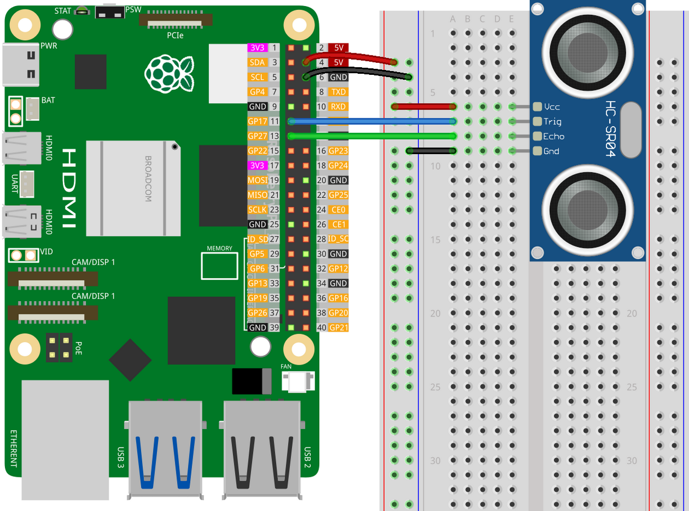

 # A ROS2 node to stream data from the ultrasonic sensor HC-SR04 via a Raspberry Pi5.

The data type of the topic is Float32.

The node publisher will push new data every 0.003 seconds.

# How to connect the Pi5 to the sensor HC-SR04 ?

